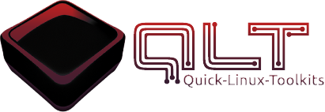

<!-- Improved compatibility of back to top link: See: https://github.com/othneildrew/Best-README-Template/pull/73 -->
<a name="readme-top"></a>
<!--
*** Thanks for checking out the Best-README-Template. If you have a suggestion
*** that would make this better, please fork the repo and create a pull request
*** or simply open an issue with the tag "enhancement".
*** Don't forget to give the project a star!
*** Thanks again! Now go create something AMAZING! :D
-->


<!-- PROJECT SHIELDS -->
<!--
*** I'm using markdown "reference style" links for readability.
*** Reference links are enclosed in brackets [ ] instead of parentheses ( ).
*** See the bottom of this document for the declaration of the reference variables
*** for contributors-url, forks-url, etc. This is an optional, concise syntax you may use.
*** https://www.markdownguide.org/basic-syntax/#reference-style-links
-->
[![Contributors][contributors-shield]][contributors-url]
[![Forks][forks-shield]][forks-url]
[![Stargazers][stars-shield]][stars-url]
[![Issues][issues-shield]][issues-url]
[![MIT License][license-shield]][license-url]
[![LinkedIn][linkedin-shield]][linkedin-url]


<!-- PROJECT LOGO -->
<br />
<div align="center">
  <a href="https://github.com/sakis-tech/Quick-Linux-Toolkits">
    
  </a>

<h3 align="center">Quick-Linux-Toolkits</h3>

  <p align="center">
    Quick-Linux-Toolkits (QLT) ist ein Bash-Skript, das entwickelt wurde, um gängige Systemverwaltungsaufgaben auf Unix-basierten Systemen zu vereinfachen. Es bietet ein interaktives Menü, mit dem Benutzer Aufgaben wie Systemupdates, Benutzerkonten erstellen und vieles mehr.
    <br />
    <br />
    <a href="https://github.com/sakis-tech/Quick-Linux-Toolkits/issues">Report Bug</a>
    ·
    <a href="https://github.com/sakis-tech/Quick-Linux-Toolkits/issues">Request Feature</a>
  </p>
</div>


<!-- TABLE OF CONTENTS -->
<details>
  <summary>Inhaltsverzeichnis</summary>
  <ol>
    <li>
      <a href="#about-the-project">Über das Projekt</a>
    </li>
    <li>
      <a href="#getting-started">Einstieg</a>
      <ul>
        <li><a href="#prerequisites">Prerequisites</a></li>
        <li><a href="#installation">Installation</a></li>
      </ul>
    </li>
    <li><a href="#usage">Usage</a></li>
    <li><a href="#roadmap">Roadmap</a></li>
    <li><a href="#contributing">Contributing</a></li>
    <li><a href="#license">License</a></li>
    <li><a href="#contact">Contact</a></li>
    <li><a href="#acknowledgments">Acknowledgments</a></li>
  </ol>
</details>


<!-- ABOUT THE PROJECT -->
## Über das Projekt

Here's a blank template to get started: To avoid retyping too much info. Do a search and replace with your text editor for the following: `sakis-tech`, `Quick-Linux-Toolkits`, `twitter_handle`, `linkedin_username`, `email_client`, `email`, `project_title`, `project_description`

<p align="right">(<a href="#readme-top">back to top</a>)</p>

<!-- GETTING STARTED -->
## Einstieg

Es gibt zwei möglichkeiten wie du QLT installieren kannst.


### Schnelle Installation

Öffne dein Terminal und füge folgendes ein. Damit lädst du das Script herunter und führst dieses auch gleich aus.
  ```sh
  hier den Code einfügen.
  ```

### Ausführliche Installation

1. Das Repository klonen.
   ```sh
   git clone https://github.com/sakis-tech/Quick-Linux-Toolkits.git
   ```
2. in den Ordner wechseln.
   ```sh
   cd Quick-Linux-Toolkits
   ```
3. die `QLT.sh` ausführbar machen und ausführen.
   ```js
   chmod +x QLT.sh && ./QLT.sh
   ```

<p align="right">(<a href="#readme-top">back to top</a>)</p>


<!-- USAGE EXAMPLES -->
## Verwendung

<div align="center">
  <a href="https://github.com/sakis-tech/Quick-Linux-Toolkits">
    
  </a>
</div>

Use this space to show useful examples of how a project can be used. Additional screenshots, code examples and demos work well in this space. You may also link to more resources.

_For more examples, please refer to the [Documentation](https://example.com)_

<p align="right">(<a href="#readme-top">back to top</a>)</p>


<!-- ROADMAP -->
## Roadmap

Eine vollständige Liste der vorgeschlagenen Funktionen (und bekannten Probleme) finden Sie in den [open issues](https://github.com/sakis-tech/Quick-Linux-Toolkits/issues).

<p align="right">(<a href="#readme-top">back to top</a>)</p>


<!-- CONTRIBUTING -->
## Mitwirken

Deine Beiträge machen die Open-Source-Community zu einem wunderbaren Ort zum Lernen, Inspirieren und Schaffen. Jeder Beitrag, den du leistest, wird sehr geschätzt.

Wenn du einen Vorschlag hast, der dies verbessern könnte, forke bitte das Repo und erstelle eine Pull-Anfrage. Du kannst auch einfach ein Problem mit dem Tag "Verbesserung" eröffnen.
Vergiss nicht, dem Projekt einen Stern zu geben! Danke nochmals!

1. Fork das Projekt.
2. Erstelle deinen eigenen Feature-Branch (`git checkout -b feature/AmazingFeature`)
3. Übernehme deine Änderungen mit dem Befehl (`git commit -m 'Add some AmazingFeature'`)
4. Push deinen Branch mit dem Befehl (`git push origin feature/AmazingFeature`)
5. Öffne eine Pull-Anfrage.

<p align="right">(<a href="#readme-top">back to top</a>)</p>

<!-- LICENSE -->
## Lizenz

Vertrieben unter der MIT-Lizenz. Weitere Informationen findest du in der Datei `LICENSE.txt`

<p align="right">(<a href="#readme-top">back to top</a>)</p>

<!-- CONTACT -->
## Kontakt

Sakis-Tech - [@mein_homelab](https://twitter.com/mein_homelab) - info@sakis.tech

Projekt-Link: [https://github.com/sakis-tech/Quick-Linux-Toolkits](https://github.com/sakis-tech/Quick-Linux-Toolkits)

<p align="right">(<a href="#readme-top">back to top</a>)</p>


<!-- Support -->
## Support

<p><a href="https://ko-fi.com/sakistech"> </a></p><br><br>

<!-- Static -->
## Statistik

<p>&nbsp;</p>


<!-- MARKDOWN LINKS & IMAGES -->
<!-- https://www.markdownguide.org/basic-syntax/#reference-style-links -->
[contributors-shield]: https://img.shields.io/github/contributors/sakis-tech/Quick-Linux-Toolkits.svg?style=for-the-badge
[contributors-url]: https://github.com/sakis-tech/Quick-Linux-Toolkits/graphs/contributors
[forks-shield]: https://img.shields.io/github/forks/sakis-tech/Quick-Linux-Toolkits.svg?style=for-the-badge
[forks-url]: https://github.com/sakis-tech/Quick-Linux-Toolkits/network/members
[stars-shield]: https://img.shields.io/github/stars/sakis-tech/Quick-Linux-Toolkits.svg?style=for-the-badge
[stars-url]: https://github.com/sakis-tech/Quick-Linux-Toolkits/stargazers
[issues-shield]: https://img.shields.io/github/issues/sakis-tech/Quick-Linux-Toolkits.svg?style=for-the-badge
[issues-url]: https://github.com/sakis-tech/Quick-Linux-Toolkits/issues
[license-shield]: https://img.shields.io/github/license/sakis-tech/Quick-Linux-Toolkits.svg?style=for-the-badge
[license-url]: https://github.com/sakis-tech/Quick-Linux-Toolkits/blob/master/LICENSE.txt
[linkedin-shield]: https://img.shields.io/badge/-LinkedIn-black.svg?style=for-the-badge&logo=linkedin&colorB=555
[linkedin-url]: https://linkedin.com/in/othneildrew
[product-screenshot]: images/screenshot.png
[Next.js]: https://img.shields.io/badge/next.js-000000?style=for-the-badge&logo=nextdotjs&logoColor=white
[Next-url]: https://nextjs.org/
[React.js]: https://img.shields.io/badge/React-20232A?style=for-the-badge&logo=react&logoColor=61DAFB
[React-url]: https://reactjs.org/
[Vue.js]: https://img.shields.io/badge/Vue.js-35495E?style=for-the-badge&logo=vuedotjs&logoColor=4FC08D
[Vue-url]: https://vuejs.org/
[Angular.io]: https://img.shields.io/badge/Angular-DD0031?style=for-the-badge&logo=angular&logoColor=white
[Angular-url]: https://angular.io/
[Svelte.dev]: https://img.shields.io/badge/Svelte-4A4A55?style=for-the-badge&logo=svelte&logoColor=FF3E00
[Svelte-url]: https://svelte.dev/
[Laravel.com]: https://img.shields.io/badge/Laravel-FF2D20?style=for-the-badge&logo=laravel&logoColor=white
[Laravel-url]: https://laravel.com
[Bootstrap.com]: https://img.shields.io/badge/Bootstrap-563D7C?style=for-the-badge&logo=bootstrap&logoColor=white
[Bootstrap-url]: https://getbootstrap.com
[JQuery.com]: https://img.shields.io/badge/jQuery-0769AD?style=for-the-badge&logo=jquery&logoColor=white
[JQuery-url]: https://jquery.com 


